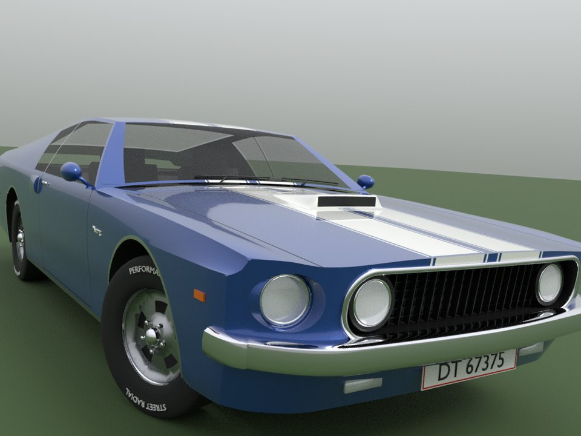
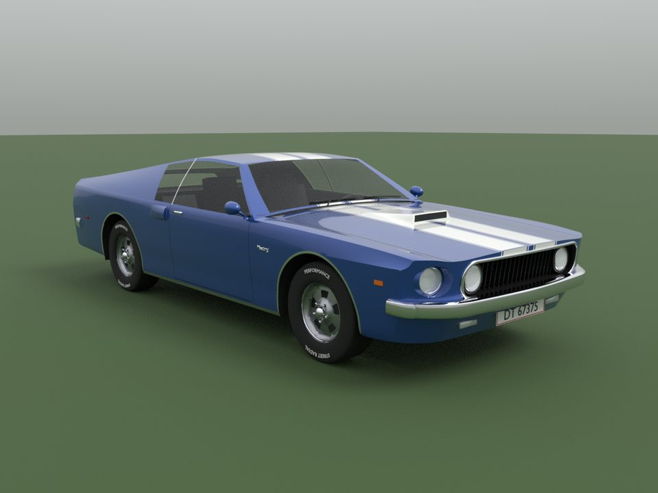
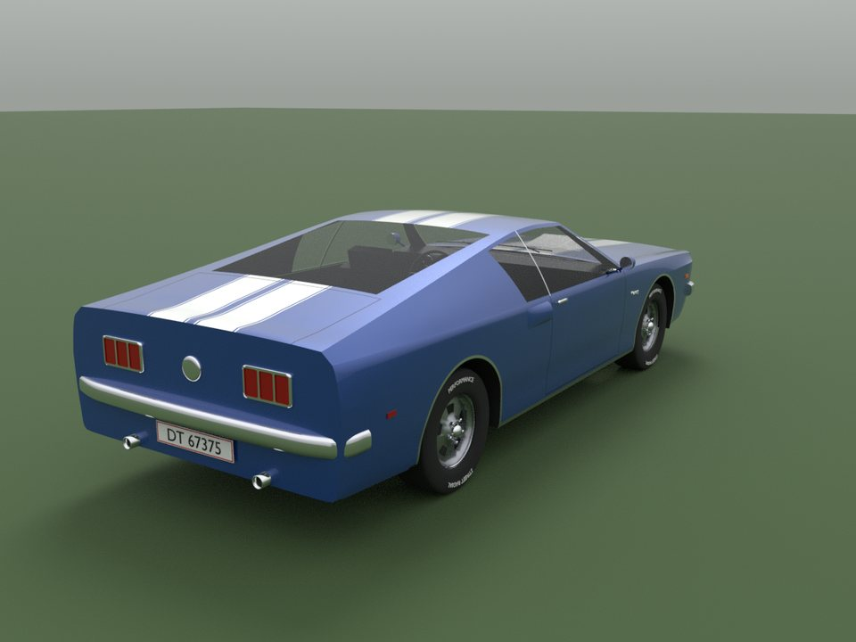
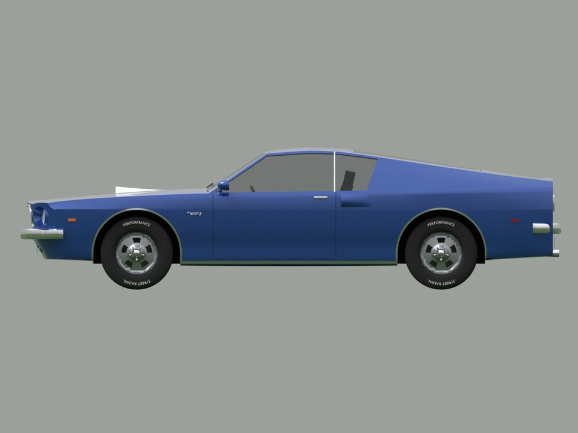
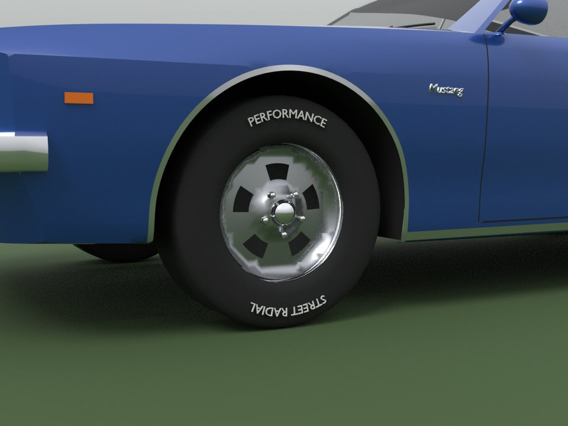

# 1969 Mustang SportsRoof

A 1969 Mustang fastback in metallic blue with white Le Mans stripes, modeled
from a reference photo of a Danish-registered car (plate DT 67375).



|  |  |
| --- | --- |
|  |  |

The model was fitted to the photo. A camera was solved from the wheel hubs,
headlights, windshield corners and stripe edges, and the hood length,
headlight spacing, scoop position and stripe widths were adjusted until the
render lined up with the photo to within about 10 pixels. The rest uses the
car's real dimensions: 108 in wheelbase, 58.5 in track and 71.3 in width.

## Files

| File | What it is |
| ---- | ---------- |
| `Mustang1969.fbx` | The model for Studio's 3D Importer: 33 meshes, 67k triangles. |
| `Mustang1969.glb` | The same model as glTF, if you'd rather import that. |
| `SetupMustang.lua` | Run once after importing. It paints, orients, scales, welds and anchors the car. |
| `Mustang1969.parts.json` | Every mesh's name, material, triangle count and bounding box. |
| `source/` | The Blender generator that builds and exports the model. |

## Put it in your game

1. In Studio, open the **3D Importer** (**File > Import 3D**, or **Import 3D**
   on the Home or Avatar tab) and pick `Mustang1969.fbx`.
2. Import it as a model. Leave mesh merging off, because the setup script
   finds each part by its name.
3. Select the imported model, open **View > Command Bar**, paste all of
   `SetupMustang.lua` and press **Enter**.

The importer brings every mesh in grey. The setup script then:

- colors each part (paint, stripes, chrome, tinted glass, rubber, lenses,
  plate and so on);
- turns the car so the model's `LookVector` points out of the front, even if
  it was imported facing backwards or lying on its side;
- scales it to 17.4 studs long, the real car at Roblox's 1 stud = 0.28 m. It
  also corrects a 3.6x import from a meters/studs mix-up;
- sets it down on whatever is under it;
- welds every part to the body (`Body_1`, the `PrimaryPart`) and anchors it.
  Only the body and tires collide.

Running it again is safe. You can change `TARGET_LENGTH`, `ANCHORED` and
the colors and materials in `STYLES` at the top of the script.

## Parts

| Meshes | Look |
| ------ | ---- |
| `Body_1`, `Body_2`, `Mirrors` | Metallic blue, `(33, 76, 156)` |
| `Stripes` | White stripes, pinstripes and the hood scoop |
| `Trim_Chrome`, `Bumpers`, `RimChrome_*` | Chrome |
| `Glass` | Tinted glass, 45% transparent |
| `Trim_Black`, `Grille`, `PanelGaps` | Black trim, grille, panel gaps |
| `Tire_*`, `TireLetters_*`, `Rim_*` | Tires, raised white letters, aluminum wheels (LF, RF, LR, RR) |
| `Headlights`, `Lamps_Red`, `Lamps_Amber` | Lenses |
| `Plates`, `PlateBorders` | Danish plates, front and rear |
| `Interior`, `Underbody` | Black cabin, floor and wheel tubs |

Each wheel is its own set of meshes centered on its axle, so you can rig
them to a chassis.

## Known limits

- **Not yet opened in Studio.** The build environment can't run Roblox
  Studio. The exported files were re-imported in Blender to check names,
  size, normals and orientation. The setup script passes a strict type check
  against Roblox's API, and headless tests in `tests/run.luau` cover painting,
  orientation, scaling, grounding and welding.
- **The back of the car isn't in the photo.** The rear end, tail lights, gas
  cap, interior and left side follow a stock 1969 SportsRoof. The photo shows
  the front and the passenger side.
- **Small details are simplified.** The grille is an egg-crate of bars, the
  badges use Blender's built-in font, and the pinstripes are about a third
  of an inch wide, which is very thin at Roblox scale.

## Rebuilding

The model is generated by `source/build.py`, which needs Blender as a Python
module:

```sh
pip install bpy==5.2.2 numpy pillow
cd models/Mustang1969/source
python build.py                                  # rewrite the .fbx, .glb and parts.json
python build.py --render out --cull --no-export  # preview renders (Cycles, CPU)
python build.py --render out --views photo --steer 20 --cull --no-export
```

`--cull` hides back faces the way Roblox does, so an inside-out surface shows
up as a hole. `--steer 20` turns the front wheels to match the photo.

| Source file | Contents |
| ----------- | -------- |
| `body.py` | Body shell: lofted lower body, greenhouse, front face, tail panel, with the stripe, glass and trim boundaries. |
| `parts.py` | Grille, headlights, bumpers, plates, hood scoop, wheels, mirrors, side scoops, badges, wipers, tail lights, wheel wells. |
| `interior.py` | Seats, dash, steering wheel, door and quarter trim. The headliner is a lining `build.py` adds under the roof. |
| `geom.py` | Surface triangulation (constrained Delaunay in each surface's parameter space), lofts, tubes. |
| `build.py`, `export.py`, `preview.py`, `text.py` | Materials, export, preview renders, text meshes. |
